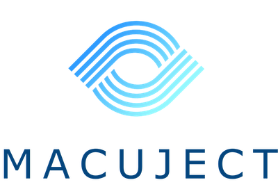

<p align="center" width="100%">
  
</p>

# .github

This is Macuject's [special `.github` repository](https://docs.github.com/en/communities/setting-up-your-project-for-healthy-contributions/creating-a-default-community-health-file). It provides organisation-wide defaults that apply to all repositories under the `macuject` GitHub organisation, including:

- **Pull request template** — a shared PR template automatically used by every repo that doesn't define its own.
- **Reusable GitHub Actions workflows** — centralised CI/CD automation consumed by individual repositories.

## Pull Request Template

The [PR template](PULL_REQUEST_TEMPLATE.md) enforces Macuject's development standards across all repositories. It prompts authors for:

- Description of changes, screenshots, and videos
- Breaking changes, security impact, and acceptance testing details
- Data migration and job change documentation
- An **impact assessment** (High / Medium / Low / None) aligned with SOC 2 and HIPAA compliance requirements
- A checklist covering code quality, documentation, and process compliance

## Reusable Workflows

All workflows are defined as [`workflow_call`](https://docs.github.com/en/actions/sharing-automations/reusing-workflows) and are intended to be consumed by other Macuject repositories.

### `create-jira-issue.yml`

Handles PRs opened by Dependabot (or PRs labelled `process-existing-pr`):

1. Assigns a random reviewer from the specified GitHub team.
2. Creates a Jira issue with the PR title and description.
3. Transitions the issue to **In Review**.
4. Renames the PR to include the Jira issue key.

### `rename-pr.yml`

Runs when a non-Dependabot PR is opened:

1. Extracts the Jira issue key from the branch name.
2. Validates and renames the PR title to the format `ISSUE-KEY: Description`.
3. Comments on the PR if the naming convention isn't met.

### `update-jira-issue.yml`

Runs when a PR is merged:

1. Validates the PR title contains a Jira issue key.
2. Determines the correct `fixVersion` based on release branch structure.
3. Updates the Jira issue's `fixVersion`.
4. Posts the PR description as a formatted comment on the Jira issue (with image support).

### `reviewer-gate.yml`

Runs when a human is requested as a reviewer on a non-Dependabot PR:

1. Checks a reviewed label (`claude-reviewed` or `claude-reviewed-again`) is present.
2. Checks a human comment, review, or non-merge commit is newer than the automated review.
3. Otherwise removes the review request and asks the author, in one comment per review, to trigger and address the Claude review first.

No repository calls it yet. A repository opts in with:

```yaml
on:
  pull_request:
    types: [review_requested]

permissions:
  contents: read
  pull-requests: write

jobs:
  gate:
    uses: macuject/.github/.github/workflows/reviewer-gate.yml@main
```

## PR Requirements

### Jira ticket association

All PRs in product repositories (WebApp, Platform, Inference Pipeline, etc.) **must** be associated with a Jira ticket in the most relevant project. The branch name must contain the issue key (e.g. `WA-123/add-feature`) so that the automation can link the PR to Jira.

For this `.github` repository:

- **Jira ticket not required** — minor changes that don't directly impact any product, such as documentation updates, template tweaks, or simple config changes.
- **Jira ticket required** — complex changes, especially to GitHub Actions workflows, **must** have a Jira issue created in the impacted product's Jira project (e.g. WebApp, Platform, Inference Pipeline). These changes can affect PR automation, issue transitions, and release processes across all repositories.
